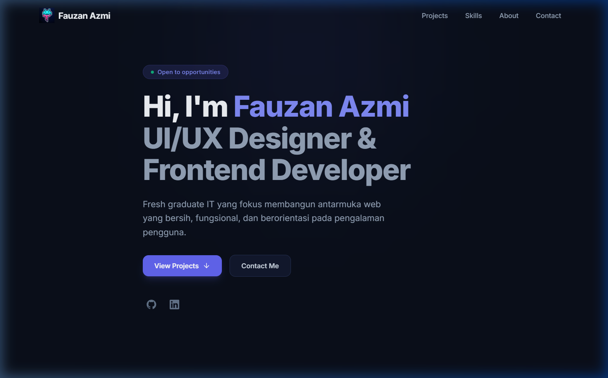
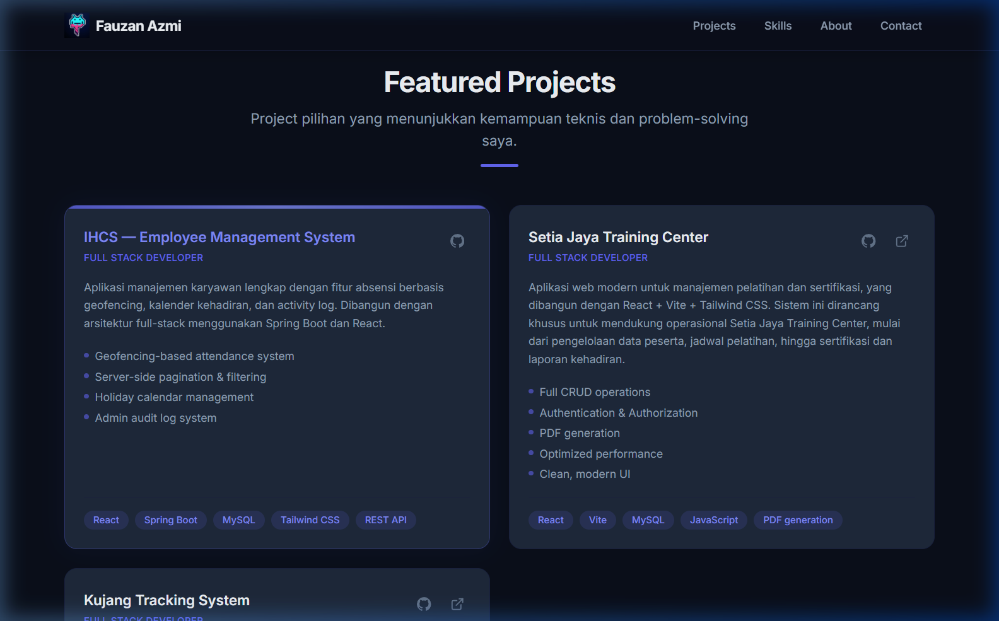
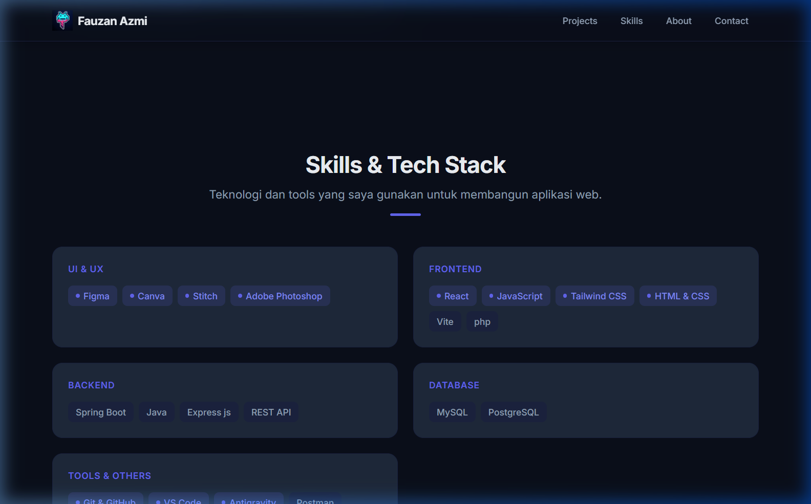
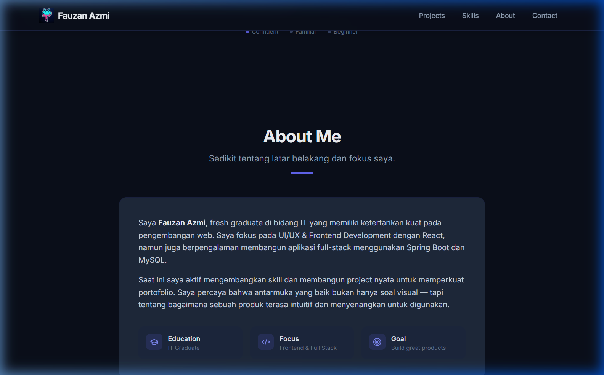
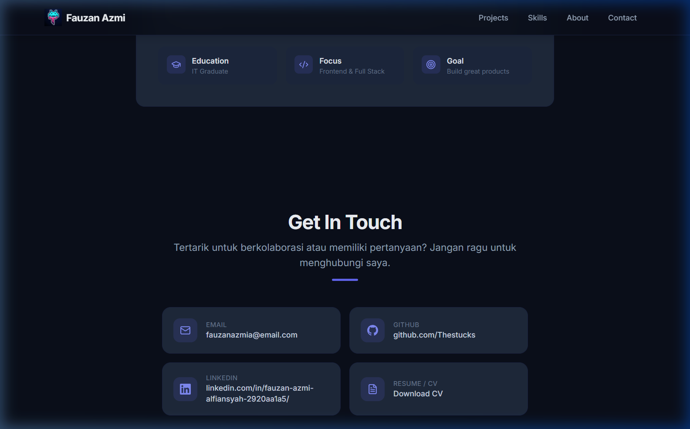
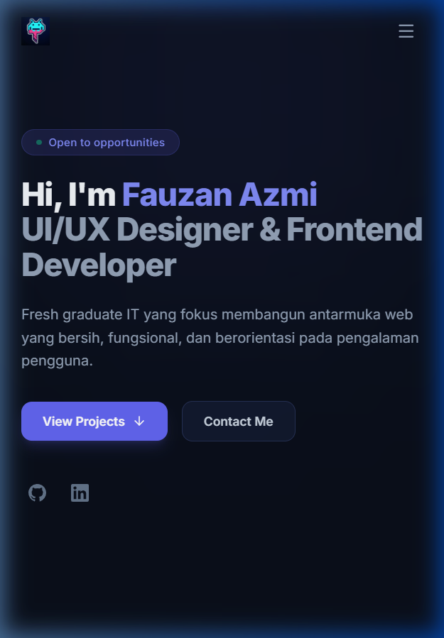
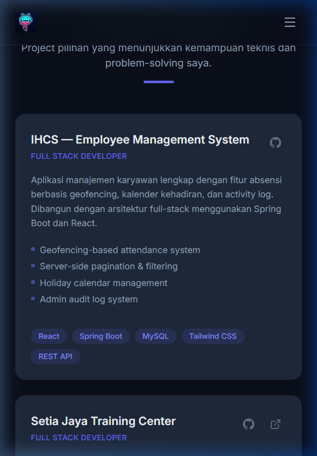

# Final Results — Fauzan Azmi Alfiansyah

## Portfolio Info
- **Nama:** Fauzan Azmi Alfiansyah
- **Repository:** [github.com/Thestucks/fauzan-azmi-portofolio](https://github.com/Thestucks/fauzan-azmi-portofolio)
- **Live URL:** [thestucks.github.io/fauzan-azmi-portofolio](https://thestucks.github.io/fauzan-azmi-portofolio/)
- **Date:** 8 Mei 2026

---

## Screenshot: Desktop

### Hero Section

### Projects Section

### Skills Section

### About Me Section

### Contact Section & Footer

---

## Screenshot: Mobile

### Hero Section (375px)

### Projects Section (375px)

---

## What I Learned

1. **RTCC-O Framework sangat membantu menjaga fokus** — Dengan mendefinisikan Role, Task, Context, Constraints, dan Output di awal, proses development jadi lebih terarah. Tidak ada waktu yang terbuang untuk fitur di luar scope MVP.

2. **Component-based architecture mempercepat development** — Memisahkan UI menjadi komponen kecil (SectionTitle, ProjectCard, SkillGroup) membuat kode lebih mudah di-maintain dan di-reuse. Data dipisah dari presentasi (`projects.js`, `skills.js`), sehingga update konten tidak perlu ubah komponen.

3. **Kolaborasi dengan AI efektif kalau promptnya jelas** — AI memberikan hasil terbaik ketika prompt menyebutkan tech stack, constraints, dan format output secara spesifik. Prompt yang ambigu menghasilkan output yang perlu banyak revisi. Framework RTCC-O membantu menyusun prompt yang terstruktur.

4. **Deployment ke GitHub Pages perlu konfigurasi base path** — Belajar bahwa SPA yang di-deploy ke subdirectory (bukan root domain) memerlukan konfigurasi `base` di Vite agar semua asset path resolve dengan benar.

5. **Import asset via Vite lebih reliable daripada path manual** — CV PDF yang awalnya menggunakan path statis tidak berfungsi setelah deploy. Setelah menggunakan `import` langsung dari `src/assets/`, Vite otomatis menangani hashing dan path resolution.

---

## Challenges & Solutions

**Challenge 1:** Asset path tidak resolve setelah deploy ke GitHub Pages
**How I Solved:** Konfigurasi `base: '/fauzan-azmi-portofolio/'` di `vite.config.js` agar semua asset menggunakan path relatif yang benar terhadap subdirectory GitHub Pages.

**Challenge 2:** CV PDF tidak bisa di-download dari production
**How I Solved:** Mengubah pendekatan dari menaruh file di `public/` folder menjadi `import` langsung dari `src/assets/`. Vite memproses file tersebut dan menghasilkan path unik dengan hash, sehingga link download berfungsi baik di development maupun production.

**Challenge 3:** Navbar tidak responsif — menu desktop muncul di mobile
**How I Solved:** Implementasi hamburger menu dengan state `mobileOpen` menggunakan React `useState`. Menu mobile menggunakan `max-h` transition untuk animasi open/close yang smooth, dan otomatis close saat window di-resize ke ukuran desktop.

**Challenge 4:** Memastikan visual tidak terlihat generik seperti template AI
**How I Solved:** Menggunakan custom design tokens (bukan default Tailwind colors), menambahkan micro-interactions (hover effects, gradient lines, glow shadows), animasi staggered pada elemen, dan custom scrollbar. Palet warna dipilih secara manual (slate + indigo accent) untuk kesan professional dan modern.
